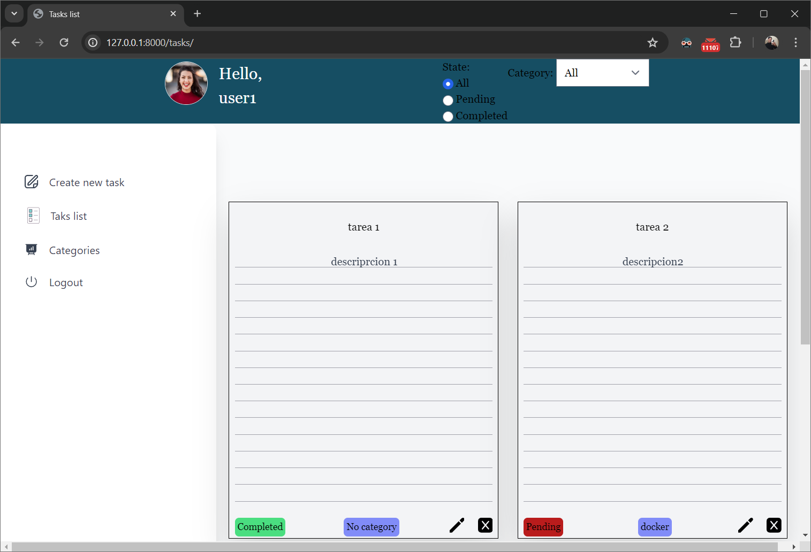

# CRUD de tareas

## Caracteristicas
- Registro de usarios 
- Rutas protegidas
- Crud de categorias por usuario
- Crud de tareas por usuario
- Uso de queryparams para filtrado de tareas con posibilidad de guardado de resultado en favoritos.

## Instalacion

- Crear entorno virtual: 

        python -m venv venv

- Activar el entorno 
    - Linux

            source venv/bin/activate

- Instalar dependencias

        pip install -r requirements.txt

## Iniciar aplicacion

        python manage.py runserver

## Acceder a la aplicacion

- http://127.0.0.1:8000/tasks/

## Usarios disponibles
| username | password    | admin panel access |
|----------|-------------|--------------------|
| user1    | Qwe123qwe!  | no                 |
| user2    | Qwe123qwe!  | no                 |
| admin    | Qwe123qwe!  | yes                |
